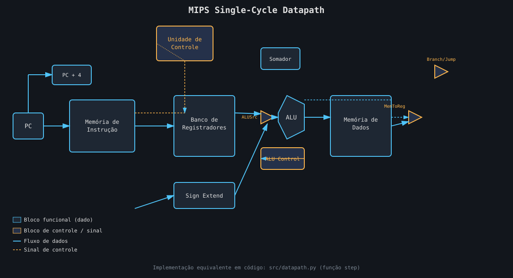

<h1 align="center">🖥️ MIPS Datapath Simulator</h1>

<p align="center">
  Simulador do <b>datapath single-cycle</b> do MIPS (o clássico do Patterson &amp; Hennessy),
  escrito em Python puro — assembler próprio + CPU que executa instrução por instrução
  mostrando cada sinal de controle passando pelos blocos do datapath.
</p>

<p align="center">
  
  
  
</p>

---

## 📌 Sobre o projeto

Este projeto nasceu de um trabalho de **Arquitetura de Computadores** (PUC-Campinas)
sobre o datapath e a unidade de controle do MIPS — que até então só existia no papel.
Em vez de deixar tudo só no caderno, resolvi implementar um simulador de verdade:

- Um **assembler** de duas passagens que converte código `.asm` em instruções codificadas
  (com resolução de labels para `beq`/`bne`/`j`/`jal`).
- Uma **CPU** que executa cada instrução percorrendo, na ordem correta, os blocos reais do
  datapath: `PC → Memória de Instrução → Unidade de Controle → Banco de Registradores →
  Sign Extend → ALU (com ALU Control) → Memória de Dados → Write Back → próximo PC`.
- Um **trace ciclo a ciclo** que imprime todos os sinais de controle (`RegDst`, `ALUSrc`,
  `MemToReg`, `RegWrite`, `MemRead`, `MemWrite`, `Branch`, `Jump`, `ALUOp`) e os valores que
  passam por cada mux/ALU, como se estivéssemos observando os fios do circuito.

<p align="center">
  
</p>

---

## 🧩 Conjunto de instruções suportado

| Tipo | Instruções |
|---|---|
| **R** | `add` `addu` `sub` `subu` `and` `or` `nor` `slt` `sll` `srl` `jr` |
| **I** | `addi` `addiu` `andi` `ori` `slti` `lui` `lw` `sw` `beq` `bne` |
| **J** | `j` `jal` |

Todos os registradores nomeados (`$t0`–`$t9`, `$s0`–`$s7`, `$a0`–`$a3`, `$v0`–`$v1`,
`$ra`, `$sp`, `$gp`, `$fp`, `$zero`, etc.) e imediatos em decimal, hexadecimal (`0x...`)
ou binário (`0b...`) são aceitos.

---

## 🚀 Como rodar

```bash
git clone https://github.com/mateusor/mips-datapath-sim.git
cd mips-datapath-sim

# roda com o trace completo do datapath (padrão)
python3 src/main.py programs/soma_vetores.asm

# roda só mostrando o estado final (sem trace ciclo a ciclo)
python3 src/main.py programs/loop_fatorial.asm --no-trace
```

Não tem nenhuma dependência externa — só Python 3 padrão.

---

## 🔎 Exemplo de saída (trace do datapath)

```
===== Ciclo 3 | PC=0x00000008 | 'add  $t2, $t0, $t1' =====
  [ID ] Unidade de Controle -> RegDst=1 ALUSrc=0 MemToReg=0 RegWrite=1 MemRead=0 MemWrite=0 Branch=0 Jump=0 ALUOp=add
  [ID ] Banco de Registradores: read1=$t0=10  read2=$t1=5
  [EX ] Mux ALUSrc -> operando B = 5 (origem: registrador)
  [EX ] ALU (add): 10 op 5 => resultado=15  Zero=0
  [MEM] (não acessada nesta instrução)
  [WB ] Mux MemToReg -> grava 15 em $t2
  [PC ] Sequencial -> PC = PC + 4 = 0x0000000c
```

---

## 📂 Programas de exemplo

| Arquivo | O que faz |
|---|---|
| `programs/soma_vetores.asm` | Soma dois vetores de 4 posições na memória de dados e grava o resultado em um terceiro vetor, usando `lw`/`sw`/`sll`/`beq`. |
| `programs/loop_fatorial.asm` | Calcula 5! usando dois laços aninhados controlados por `beq`/`j` (não há `mul` no subset, então a multiplicação é feita por somas repetidas). |

---

## ⚙️ Tabela de sinais de controle

| Instrução | RegDst | ALUSrc | MemToReg | RegWrite | MemRead | MemWrite | Branch | ALUOp |
|---|---|---|---|---|---|---|---|---|
| R-type (`add`, `sub`, ...) | 1 | 0 | 0 | 1 | 0 | 0 | 0 | função |
| `lw` | 0 | 1 | 1 | 1 | 1 | 0 | 0 | add |
| `sw` | X | 1 | X | 0 | 0 | 1 | 0 | add |
| `beq` / `bne` | X | 0 | X | 0 | 0 | 0 | 1 | sub |
| `addi` | 0 | 1 | 0 | 1 | 0 | 0 | 0 | add |

Essa tabela é exatamente o que `control_unit()` (em `src/datapath.py`) implementa em código.

---

## 🗂️ Estrutura do projeto

```
mips-datapath-sim/
├── src/
│   ├── isa.py         # tabela de opcodes, funct e registradores
│   ├── assembler.py   # assembler de 2 passagens (labels + codificação)
│   ├── datapath.py     # CPU: unidade de controle, ALU, datapath, trace
│   └── main.py         # CLI de execução
├── programs/
│   ├── soma_vetores.asm
│   └── loop_fatorial.asm
├── docs/
│   └── datapath.svg    # diagrama do datapath
└── README.md
```

---

## 🎯 Próximos passos

- [ ] Suporte a pseudo-instruções (`li`, `move`, `blt`, ...)
- [ ] Versão multi-cycle / pipeline (com forwarding e detecção de hazards)
- [ ] Exportar o trace em CSV para plotar os sinais ciclo a ciclo

---

<p align="center">Feito por <a href="https://github.com/mateusor">mateusor</a> — projeto de Arquitetura de Computadores, PUC-Campinas</p>
